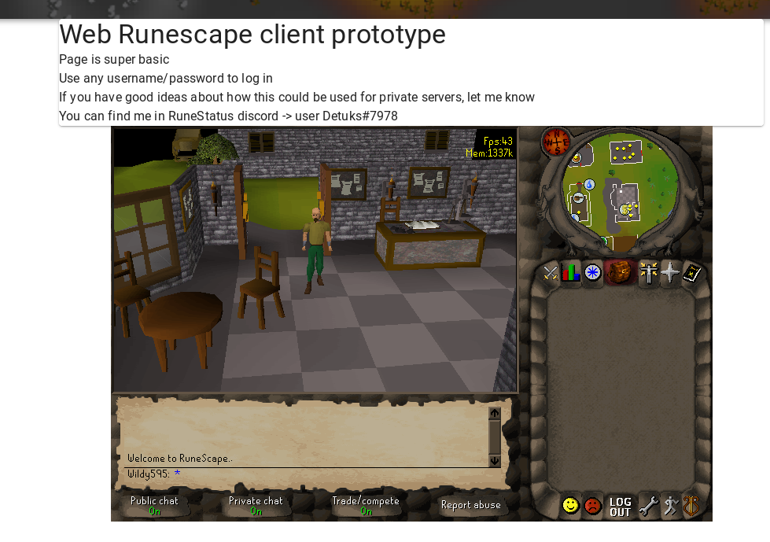

# Runescape 377 Web client

It is a bit out of date on packages and rust version.

## Setup

* Make sure server is running -> https://github.com/reinismu/apollo
* Change `Configuration` file based on your server
* Run client `npm install && npm run dev`

## USEFUL links

* 377 client https://github.com/Promises/refactored-client-377
* 317 c# https://github.com/HelloKitty/RS317.Sharp
* server https://github.com/apollo-rsps/apollo
* caches https://www.mediafire.com/?xng9h28c0811s

